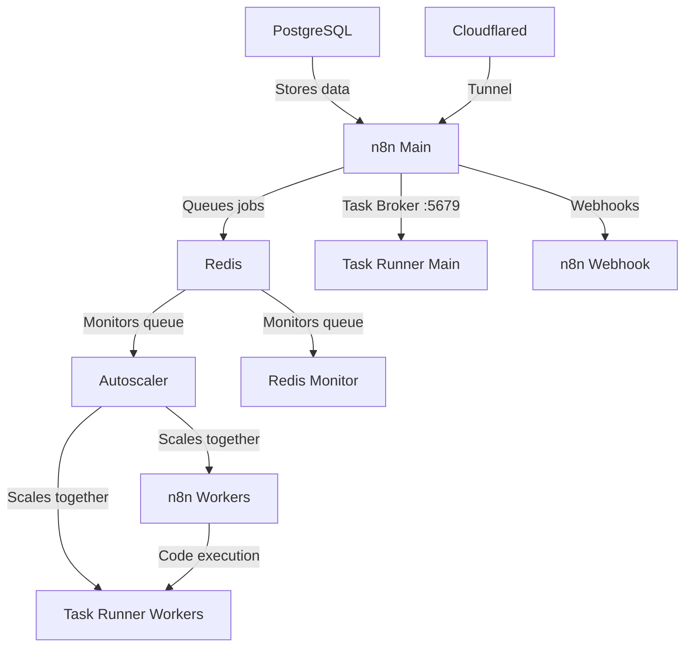

# n8n Autoscaling System (n8n 2.0 Ready)

A Docker-based autoscaling solution for n8n workflow automation platform. Dynamically scales worker containers based on Redis queue length. No need to deal with k8s or any other container scaling provider - a simple script runs it all and is easily configurable.

**Now updated for n8n 2.0** with external task runners support.

Tested with hundreds of simultaneous executions running on an 8 core 16gb ram VPS.

Includes Puppeteer and Playwright with Chromium built-in for pro level scraping from the n8n code node. Stealth plugins included for bot detection evasion.

Simple install, just clone the files + docker compose up

## What's New in n8n 2.0

n8n 2.0 introduced breaking changes for task runners:
- Task runners are now **separate containers** (external mode)
- Each worker needs its own task runner sidecar
- The main n8n instance exposes a task broker on port 5679
- External packages must be configured in the task runner image

This build handles all of this automatically - the autoscaler scales both workers and their task runners together.

## Architecture Overview



### Services

| Service | Description |
|---------|-------------|
| `n8n` | Main n8n instance (editor, API) |
| `n8n-task-runner` | Task runner for main instance |
| `n8n-webhook` | Dedicated webhook processor |
| `n8n-worker` | Queue workers (autoscaled) |
| `n8n-worker-runner` | Task runners for workers (autoscaled 1:1 with workers) |
| `redis` | Job queue |
| `postgres` | Database (with pgvector) |
| `n8n-autoscaler` | Monitors queue and scales workers + runners |
| `redis-monitor` | Queue monitoring |
| `n8n-backup` | Scheduled backups to cloud storage (optional) |
| `cloudflared` | Cloudflare tunnel |

## Features

- Dynamic scaling of n8n worker containers based on queue length
- **n8n 2.0 compatible** - external task runners with proper sidecar scaling
- Configurable scaling thresholds and limits
- Redis queue monitoring with password authentication
- Docker Compose based deployment with modular override files
- Health checks and centralized log rotation for all services
- **Security hardened** - Redis auth, localhost port binding, PostgreSQL user separation, non-root containers
- Puppeteer and Playwright with Chromium for web scraping in Code nodes
- Stealth plugins for bot detection evasion
- External npm packages (ajv, puppeteer-core, playwright-core, etc.)
- Scheduled backups with PostgreSQL + Redis + volume data, GPG encryption, multi-cloud upload
- Interactive setup wizard and systemd service generator
- Multi-architecture support (amd64, arm64, armhf)
- Podman rootless support via compose override
- Example workflows ready to import

## Prerequisites

- Docker and Docker Compose (or Podman with podman-compose)
- If you are a new user, I recommend either Docker Desktop or using the docker convenience script for Ubuntu
- Set up your Cloudflare domain and subdomains

## Quick Start

### Option A: Interactive Setup Wizard (Recommended)

```bash
git clone https://github.com/conor-is-my-name/n8n-autoscaling.git
cd n8n-autoscaling
./n8n-setup.sh
```

The setup wizard will guide you through:
- Creating `.env` from the template
- Generating secure random secrets
- Configuring timezone, URLs, Cloudflare tunnel, Tailscale
- Setting autoscaling parameters
- Configuring backups (schedule, encryption, cloud storage, notifications)
- Detecting your container runtime (Docker/Podman, rootless/rootful)
- Creating the external network
- Starting all services with health checks

### Option B: Manual Setup

1. Clone this repository:
   ```bash
   git clone https://github.com/conor-is-my-name/n8n-autoscaling.git
   cd n8n-autoscaling
   ```

2. Copy the example environment file:
   ```bash
   cp .env.example .env
   ```

3. Configure your environment variables in `.env`:
   - Set strong passwords for `REDIS_PASSWORD`, `POSTGRES_ADMIN_PASSWORD`, `POSTGRES_PASSWORD`, `N8N_ENCRYPTION_KEY`, `N8N_RUNNERS_AUTH_TOKEN`
   - Update domain settings (`N8N_HOST`, `N8N_WEBHOOK`, etc.)
   - Add your `CLOUDFLARE_TUNNEL_TOKEN`
   - Optionally set `TAILSCALE_IP` for private access

4. Create the external network:
   ```bash
   docker network create shark
   ```

5. Start everything:
   ```bash
   docker compose up -d --build
   ```

## Configuration

### Key Environment Variables

| Variable | Description | Default |
|----------|-------------|---------|
| `MIN_REPLICAS` | Minimum number of worker containers | 1 |
| `MAX_REPLICAS` | Maximum number of worker containers | 5 |
| `SCALE_UP_QUEUE_THRESHOLD` | Queue length to trigger scale up | 5 |
| `SCALE_DOWN_QUEUE_THRESHOLD` | Queue length to trigger scale down | 1 |
| `POLLING_INTERVAL_SECONDS` | How often to check queue length | 10 |
| `COOLDOWN_PERIOD_SECONDS` | Time between scaling actions | 10 |

### Task Runner Configuration (n8n 2.0)

| Variable | Description | Default |
|----------|-------------|---------|
| `N8N_RUNNERS_ENABLED` | Enable external task runners | true |
| `N8N_RUNNERS_MODE` | Task runner mode | external |
| `N8N_RUNNERS_AUTH_TOKEN` | Auth token for runners | (set your own) |
| `N8N_RUNNERS_MAX_CONCURRENCY` | Max concurrent tasks per runner | 5 |
| `NODE_FUNCTION_ALLOW_EXTERNAL` | Allowed npm packages in Code nodes | ajv,puppeteer-core,playwright-core,... |

### Timeout Configuration

Adjust these to be greater than your longest expected workflow execution time (in seconds):
```
N8N_QUEUE_BULL_GRACEFULSHUTDOWNTIMEOUT=300
N8N_GRACEFUL_SHUTDOWN_TIMEOUT=300
```

## Scaling Behavior

The autoscaler:
1. Monitors Redis queue length every `POLLING_INTERVAL_SECONDS`
2. Scales up when:
   - Queue length > `SCALE_UP_QUEUE_THRESHOLD`
   - Current replicas < `MAX_REPLICAS`
3. Scales down when:
   - Queue length < `SCALE_DOWN_QUEUE_THRESHOLD`
   - Current replicas > `MIN_REPLICAS`
4. Respects cooldown period between scaling actions
5. **Scales workers and task runners together** (1:1 ratio)

## Security

### Redis Authentication

Redis requires password authentication. Set `REDIS_PASSWORD` in your `.env` file. The password is automatically propagated to all services that connect to Redis (n8n, autoscaler, monitor, backup).

### Port Binding

By default, all ports bind to `127.0.0.1` (localhost only). This means services are not accessible from external networks unless you:
- Set `TAILSCALE_IP` to bind to your Tailscale interface
- Use the Cloudflare tunnel for external access

### PostgreSQL User Separation

The system uses two PostgreSQL users:
- **Admin user** (`POSTGRES_ADMIN_USER`/`POSTGRES_ADMIN_PASSWORD`): Superuser for database management
- **Application user** (`POSTGRES_USER`/`POSTGRES_PASSWORD`): Limited-privilege user for n8n

The `init-postgres.sh` script runs on first PostgreSQL initialization to create the application database and user. Set `POSTGRES_APP_PASSWORD` in `.env` to enable this separation.

## Compose Override Files

Modular override files allow you to customize the deployment without editing the main `docker-compose.yml`:

| File | Purpose | Usage |
|------|---------|-------|
| `docker-compose.cloudflare.yml` | Binds n8n to localhost only (Cloudflare handles access) | `-f docker-compose.yml -f docker-compose.cloudflare.yml` |
| `docker-compose.podman.yml` | Adds `:Z,U` flags for rootless Podman SELinux/UID mapping | `-f docker-compose.yml -f docker-compose.podman.yml` |

Example with Cloudflare override:
```bash
docker compose -f docker-compose.yml -f docker-compose.cloudflare.yml up -d
```

To enable the Cloudflare override with the setup wizard or systemd generator, set `ENABLE_CLOUDFLARE_OVERRIDE=true` in your `.env`.

## Systemd Integration

Generate a systemd service file for automatic startup:

```bash
./generate-systemd.sh
```

The generator will:
- Detect Docker vs Podman and rootless vs rootful mode
- Build the correct compose file list with detected overrides
- Create a system or user-level service file
- Optionally enable and start the service

## Log Rotation

All services use centralized log rotation configured via `.env`:

```env
LOG_DRIVER=json-file    # Docker log driver
LOG_MAX_SIZE=10m        # Max size per log file
LOG_MAX_FILE=3          # Number of log files to retain
```

## Performance Tuning

See the "Performance Tuning" section at the bottom of `.env.example` for tuning guidance organized by workload tier:
- **Light** (2-4GB RAM): Small teams, <100 workflows
- **Medium** (8-16GB RAM): Teams, 100-500 workflows
- **Heavy** (32GB+ RAM): Large-scale, 500+ workflows with high concurrency

## Adding External Packages

### Pre-installed JavaScript Packages

The following npm packages are pre-installed and ready to use in JavaScript Code nodes:

| Package | Description |
|---------|-------------|
| `puppeteer-core` | Browser automation (Puppeteer) |
| `puppeteer-extra` | Puppeteer with plugin support |
| `puppeteer-extra-plugin-stealth` | Bot detection evasion |
| `playwright-core` | Browser automation (Playwright) |
| `playwright-extra` | Playwright with plugin support |
| `ajv` | JSON schema validation |
| `ajv-formats` | Additional AJV formats |
| `moment` | Date/time manipulation |

### Pre-installed Python Packages

The following pip packages are pre-installed for Python Code nodes:

| Package | Description |
|---------|-------------|
| `requests` | HTTP library |
| `pillow` | Image processing (PIL) |
| `pandas` | Data analysis |
| `numpy` | Numerical computing |

### Pre-installed System Utilities

The following command-line tools are available via `subprocess`:

| Tool | Description |
|------|-------------|
| `chromium` | Headless browser |
| `ffmpeg` / `ffprobe` | Video/audio processing |
| `imagemagick` | Image manipulation (`magick`, `convert`, `identify`, `mogrify`, `composite`) |
| `graphicsmagick` | Image manipulation (`gm`) |
| `git` | Version control |

### Adding More npm Packages

To add additional npm packages for JavaScript Code nodes:

1. Edit `Dockerfile.runner` and add packages to the pnpm install:
   ```dockerfile
   RUN /usr/local/bin/node /usr/local/lib/node_modules/corepack/dist/corepack.js pnpm add \
       ajv \
       ajv-formats \
       puppeteer-core@22.15.0 \
       your-package-here
   ```

2. Edit `n8n-task-runners.json` and add your package to the allowlist:
   ```json
   "NODE_FUNCTION_ALLOW_EXTERNAL": "moment,ajv,ajv-formats,puppeteer-core,playwright-core,your-package-here"
   ```

3. Rebuild:
   ```bash
   docker compose build --no-cache n8n-task-runner n8n-worker-runner
   docker compose up -d
   ```

### Adding More Python Packages

To add additional pip packages for Python Code nodes:

1. Edit `Dockerfile.runner` and add packages to the uv pip install:
   ```dockerfile
   RUN /usr/local/bin/uv pip install --python /opt/runners/task-runner-python/.venv/bin/python --no-cache \
       requests \
       pillow \
       pandas \
       numpy \
       your-package-here
   ```

2. Edit `n8n-task-runners.json` and update the Python runner's env-overrides:
   ```json
   "N8N_RUNNERS_EXTERNAL_ALLOW": "requests,pillow,PIL,pandas,numpy,your-package-here"
   ```

3. If your package needs stdlib modules (like `subprocess`), add them too:
   ```json
   "N8N_RUNNERS_STDLIB_ALLOW": "datetime,json,math,os,re,io,base64,hashlib,urllib,subprocess"
   ```

4. Rebuild:
   ```bash
   docker compose build --no-cache n8n-task-runner n8n-worker-runner
   docker compose up -d
   ```

### Adding System Utilities (Linux packages)

To add command-line tools (like ImageMagick, tesseract, poppler, etc.):

1. Edit `Dockerfile.runner` and add packages to the Alpine builder stage:
   ```dockerfile
   FROM alpine:3.23 AS builder

   RUN apk add --no-cache \
       chromium \
       ... \
       imagemagick \
       tesseract-ocr \
       poppler-utils
   ```

2. Add COPY commands to copy the binaries to the final image:
   ```dockerfile
   # Copy binaries from builder
   COPY --from=builder /usr/bin/tesseract /usr/bin/tesseract
   COPY --from=builder /usr/bin/pdftotext /usr/bin/pdftotext
   ```

3. Rebuild:
   ```bash
   docker compose build --no-cache n8n-task-runner n8n-worker-runner
   docker compose up -d
   ```

**Note:** The runner image uses a multi-stage build. System packages are installed in an Alpine builder stage, then binaries and libraries are copied to the final `n8nio/runners` image. This is necessary because the base runners image doesn't include `apk`.

### Installing Community Nodes

Community nodes are third-party n8n nodes that add new integrations (e.g., n8n-nodes-discord, n8n-nodes-notion). They're different from Code node packages - they add entirely new node types to your workflow editor.

**Via the n8n UI (Recommended):**

1. Ensure community packages are enabled (they are by default in this build):
   ```env
   N8N_COMMUNITY_PACKAGES_ENABLED=true
   ```

2. In n8n, go to **Settings** > **Community nodes**

3. Click **Install** and enter the npm package name (e.g., `n8n-nodes-discord`)

4. The node will be installed to the shared volume and available to all workers automatically

**Pre-installing in Dockerfile (for consistent deployments):**

1. Edit `Dockerfile` and add the community node package:
   ```dockerfile
   # Install community nodes
   RUN cd /usr/local/lib/node_modules/n8n && \
       npm install n8n-nodes-discord n8n-nodes-notion
   ```

2. Rebuild all n8n images:
   ```bash
   docker compose build --no-cache n8n n8n-webhook n8n-worker
   docker compose up -d
   ```

**Important notes:**
- Community nodes are installed into **n8n itself**, not the task runners
- The `n8n_main` volume is shared between `n8n` and `n8n-worker`, so nodes installed via UI are automatically available to workers
- If a community node requires system dependencies, you may need to add them to the main `Dockerfile` (not `Dockerfile.runner`)

## Monitoring

The system includes:
- Redis queue monitor service (`redis-monitor`)
- Docker health checks for all services
- Detailed logging from autoscaler

View logs:
```bash
# All services
docker compose logs -f

# Specific service
docker compose logs -f n8n-autoscaler

# Task runners
docker compose logs -f n8n-task-runner n8n-worker-runner
```

## Backup Configuration

The `n8n-backup` service provides scheduled backups of your PostgreSQL database and n8n volume data, with optional encryption and multi-cloud storage upload via [rclone](https://rclone.org/).

### What Gets Backed Up

- **PostgreSQL database** (workflows, credentials, executions, users) via `pg_dump`
- **Redis data** (job queue state) via `BGSAVE` + compressed RDB dump
- **n8n volume data** (custom nodes, local file storage) via tar archive
- Everything bundled into a single timestamped `.tar.gz` archive

### Quick Setup

1. Copy the example rclone config:
   ```bash
   cp backup/rclone.conf.example backup/rclone.conf
   ```

2. Edit `backup/rclone.conf` with your cloud storage credentials (see [rclone docs](https://rclone.org/docs/) for your provider)

3. Uncomment the rclone.conf volume mount in `docker-compose.yml`:
   ```yaml
   - ./backup/rclone.conf:/config/rclone/rclone.conf:ro
   ```

4. Add backup settings to your `.env`:
   ```env
   COMPOSE_PROFILES=backup
   BACKUP_RCLONE_DESTINATIONS=r2:my-bucket/n8n-backups
   BACKUP_SCHEDULE=0 2 * * *
   ```

5. Start the backup service:
   ```bash
   docker compose up -d
   ```
   Or start it explicitly without modifying `.env`:
   ```bash
   docker compose --profile backup up -d
   ```

### Backup Environment Variables

| Variable | Description | Default |
|----------|-------------|---------|
| `BACKUP_SCHEDULE` | Cron schedule for backups | `0 2 * * *` (daily 2 AM) |
| `BACKUP_RETENTION_DAYS` | Days to keep old backups | `30` |
| `BACKUP_ENCRYPTION_KEY` | GPG passphrase (empty = no encryption) | (empty) |
| `BACKUP_RCLONE_DESTINATIONS` | Comma-separated rclone remotes | (empty = local only) |
| `BACKUP_RUN_ON_START` | Run backup immediately on container start | `false` |
| `BACKUP_DELETE_LOCAL_AFTER_UPLOAD` | Delete local copy after successful remote upload | `false` |
| `BACKUP_WEBHOOK_URL` | Webhook URL for notifications | (empty) |
| `SMTP_HOST` | SMTP server for email notifications | (empty) |
| `SMTP_PORT` | SMTP port | `587` |
| `SMTP_USER` | SMTP username | (empty) |
| `SMTP_PASSWORD` | SMTP password | (empty) |
| `SMTP_TO` | Notification email recipient | (empty) |

### Multiple Cloud Destinations

Upload to multiple providers simultaneously by comma-separating destinations:
```env
BACKUP_RCLONE_DESTINATIONS=r2:my-bucket/n8n,s3:backup-bucket/n8n,b2:my-b2-bucket/n8n
```

### Testing Backups

Run a one-off backup to verify your configuration:
```env
BACKUP_RUN_ON_START=true
```
```bash
docker compose --profile backup up n8n-backup
```

### Restoring from a Backup

1. **Decrypt** (if encrypted):
   ```bash
   gpg --decrypt n8n-backup-TIMESTAMP.tar.gz.gpg > n8n-backup-TIMESTAMP.tar.gz
   ```

2. **Extract** the archive:
   ```bash
   tar xzf n8n-backup-TIMESTAMP.tar.gz
   ```

3. **Restore the database**:
   ```bash
   docker compose exec -T postgres pg_restore -U postgres -d n8n --clean --if-exists < database.dump
   ```

4. **Restore volume data** (stop n8n first):
   ```bash
   docker compose stop n8n n8n-worker n8n-webhook
   tar xzf volumes.tar.gz -C /var/lib/docker/volumes/n8n-autoscaling_n8n_main/_data/
   docker compose start n8n n8n-worker n8n-webhook
   ```

**Important:** Your `N8N_ENCRYPTION_KEY` and `N8N_USER_MANAGEMENT_JWT_SECRET` must match the values used when the backup was created, otherwise n8n credentials cannot be decrypted. Keep these values safe separately from your backups.

## Updating

To update:
```bash
docker compose down
docker compose build --no-cache
docker compose up -d
```

## Troubleshooting

### Check container status
```bash
docker compose ps
```

### Check logs
```bash
docker compose logs [service]
```

### Verify Redis connection
```bash
docker compose exec redis redis-cli --no-auth-warning -a "$REDIS_PASSWORD" ping
```

### Check queue length
```bash
docker compose exec redis redis-cli --no-auth-warning -a "$REDIS_PASSWORD" LLEN bull:jobs:wait
```

### Task runner issues
If Code nodes fail, check task runner logs:
```bash
docker compose logs n8n-task-runner
```

Verify the task broker is accessible:
```bash
docker compose exec n8n-task-runner wget -qO- http://n8n:5679/health || echo "Not reachable"
```

### Webhook URL format
Webhooks use your Cloudflare subdomain:
```
https://webhook.yourdomain.com/webhook/your-webhook-id
```

## File Structure

```
.
├── docker-compose.yml              # Main compose file
├── docker-compose.cloudflare.yml   # Cloudflare tunnel override (localhost binding)
├── docker-compose.podman.yml       # Podman rootless override (SELinux/UID flags)
├── Dockerfile                      # Main n8n image (based on n8nio/n8n)
├── Dockerfile.runner               # Task runner image (based on n8nio/runners)
├── n8n-task-runners.json           # Task runner launcher config
├── init-postgres.sh                # PostgreSQL app user initialization
├── n8n-setup.sh                    # Interactive setup wizard
├── generate-systemd.sh             # Systemd service generator
├── .env.example                    # Example environment configuration
├── .env                            # Your configuration (git-ignored)
├── .dockerignore                   # Docker build context exclusions
├── examples/                       # Example n8n workflows
├── autoscaler/
│   ├── Dockerfile                  # Autoscaler container (Python 3.12, multi-arch)
│   └── autoscaler.py               # Scaling logic
├── backup/
│   ├── Dockerfile                  # Backup container
│   ├── backup.py                   # Backup logic (pg_dump + Redis + rclone)
│   └── rclone.conf.example         # Example rclone storage config
└── monitor/
    └── monitor.Dockerfile          # Redis monitor container (non-root)
```

## Task Runner Security Configuration

The `n8n-task-runners.json` file controls security settings for the JavaScript task runner:

| Setting | Description |
|---------|-------------|
| `NODE_ENV=test` | Disables prototype freezing (required for puppeteer/playwright) |
| `NODE_FUNCTION_ALLOW_EXTERNAL` | Comma-separated list of allowed npm packages |
| `NODE_FUNCTION_ALLOW_BUILTIN` | Allowed Node.js built-in modules |
| `PUPPETEER_EXECUTABLE_PATH` | Path to chromium binary |
| `PLAYWRIGHT_CHROMIUM_EXECUTABLE_PATH` | Path to chromium binary for Playwright |

**Note:** The default config removes sandbox restrictions to allow puppeteer/playwright and libraries like AJV that use `new Function()`. If you don't need these, you can restore the original security settings from the n8nio/runners image.

## Example Workflows

The `examples/` folder contains ready-to-import n8n workflows demonstrating browser automation:

| File | Description |
|------|-------------|
| `puppeteer-screenshot.json` | Take screenshots with Puppeteer |
| `puppeteer-scrape.json` | Scrape Hacker News with Puppeteer |
| `puppeteer-stealth.json` | Bot detection evasion test |
| `playwright-screenshot.json` | Take screenshots with Playwright |
| `playwright-scrape.json` | Scrape Hacker News with Playwright |
| `playwright-pdf.json` | Generate PDFs from web pages |
| `playwright-stealth.json` | Bot detection evasion test |

Import via: **Workflows** > **Add Workflow** > **Import from File**

### Quick Example (Puppeteer)

```javascript
const puppeteer = require('puppeteer-core');

const browser = await puppeteer.launch({
  executablePath: '/usr/bin/chromium-browser',
  headless: true,
  args: ['--no-sandbox', '--disable-setuid-sandbox', '--disable-dev-shm-usage']
});

const page = await browser.newPage();
await page.goto('https://example.com');
const title = await page.title();
await browser.close();

return [{ json: { title } }];
```

### Quick Example (Playwright with Stealth)

```javascript
const { chromium } = require('playwright-extra');
const StealthPlugin = require('puppeteer-extra-plugin-stealth');

chromium.use(StealthPlugin());

const browser = await chromium.launch({
  executablePath: '/usr/bin/chromium-browser',
  headless: true,
  args: ['--no-sandbox', '--disable-setuid-sandbox', '--disable-dev-shm-usage']
});

const page = await browser.newPage();
await page.goto('https://example.com');
const title = await page.title();
await browser.close();

return [{ json: { title } }];
```

## License

MIT License - See [LICENSE](LICENSE) for details.

## Credits

For step by step instructions follow this guide: https://www.reddit.com/r/n8n/comments/1l9mi6k/major_update_to_n8nautoscaling_build_step_by_step/

Now includes Cloudflared. Configure on cloudflare.com and paste your token in the .env file.
